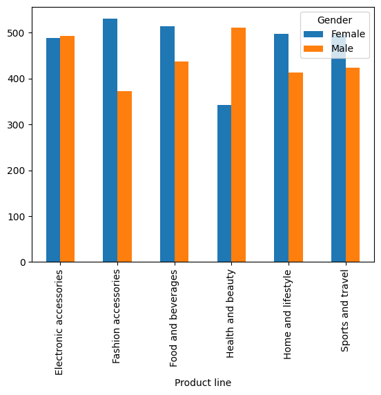
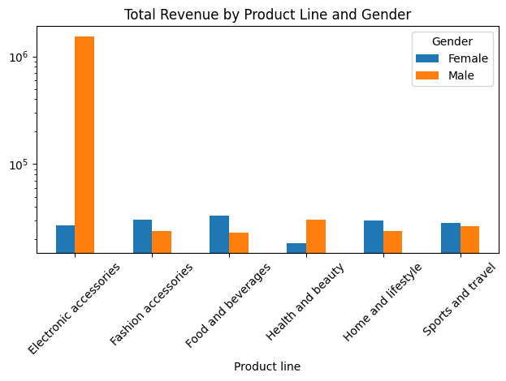
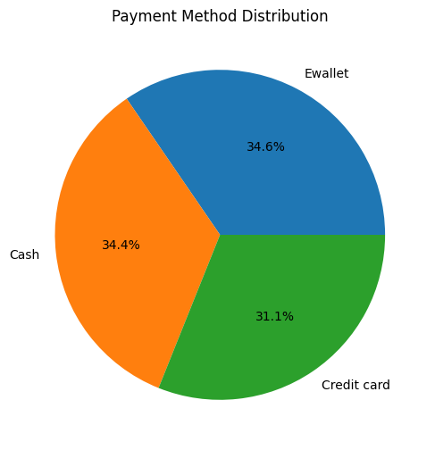

# 📊 Supermarket Sales Analysis

## 📌 Objective
Analyze supermarket transaction data to uncover sales patterns, customer behavior, and business insights.

---

## 📂 Dataset Information
- Source: Kaggle Supermarket Sales Dataset  
- Total Records: ~1000 transactions  
- Features: Branch, City, Customer Type, Gender, Product Line, Total, Date, Payment  

---

## 🛠️ Techniques Used
- Data Cleaning  
- Data Manipulation (Filtering, Sorting, Grouping)  
- Feature Engineering (Datetime → Hour, Time Category)  
- Pivot Table & Crosstab  
- Data Visualization (Matplotlib, Seaborn)  
- Data Scaling (StandardScaler, MinMaxScaler)  

---

## 📈 Analysis & Visualization

### 1. Quantity by Product Line and Gender

**Insight:**  
Female customers contribute more purchases in most categories, while male customers dominate in Health & Beauty.

---

### 2. Total Revenue by Product Line

**Insight:**  
Revenue is dominated by Food & Beverages and Fashion Accessories, indicating strong demand in these categories.

---
### 3. Payment Method Distribution

**Insight:**  
Cash is the most frequently used payment method, followed by E-wallet and Credit Card.

---

## 🔍 Key Insights
- Sales peak occurs during the afternoon and evening  
- Fashion accessories are the most purchased product category  
- Cash is the most frequently used payment method  
- Female customers contribute more to overall sales  

---

## 📊 Analysis Conclusion

1. Product categories show varying sales performance, with **Food & Beverages** contributing significantly higher sales compared to others.  
2. The most frequently used payment methods are **E-wallet and Cash**, with higher transaction counts than other methods.  
3. Branch **C** has the highest contribution to total sales performance.  
4. Based on gender analysis, **female customers contribute more significantly to total transactions**.  
5. Sales activity peaks during the **afternoon**, indicating higher purchasing behavior at specific time periods.  
6. Data scaling helps normalize numerical variables, making them more comparable and suitable for further analysis or machine learning modeling.  

---

## 💼 Final Business Insights
- Best-selling product category: **Fashion Accessories**  
- Peak sales time: **Afternoon**  
- Most used payment method: **Cash**  
- Female customers contribute more to overall sales  
- Branch C shows the best performance  

---

## 🚀 Recommendation
- Focus promotional campaigns during **afternoon hours**  
- Target marketing strategies toward **female customers**  
- Optimize inventory for **best-selling products**  
